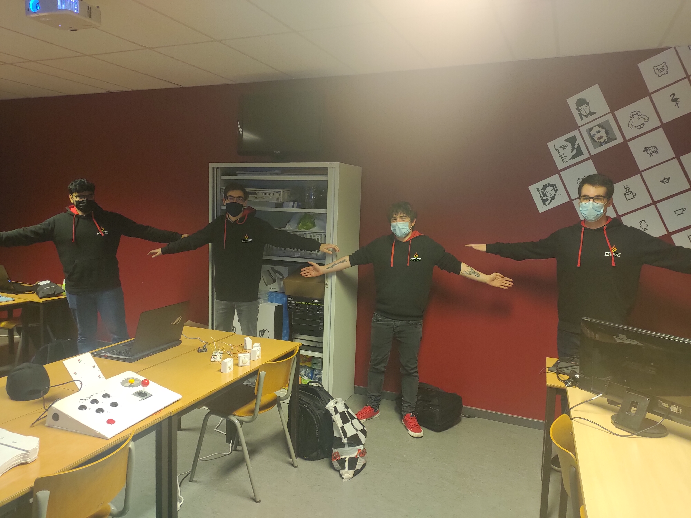

# Ctrl-Alt

Project made during the Alternative Controllers Class @ TheGameDevAcademy

# Arduino

This project is a demo to connect unreal engine 4 with an arduino board and a websocket node server
The web page uses pose detection and send informations to the node server using websockets
The server sends informations to unreal using websockets
Unreal communicates with the arduino board to receive inputs from the player

# How to play

We have imagined a defuse the bomb where one player would stand in front of a camera and a screen (web page index.html) and has to take a pose without moving while the other(s) press buttons to execute the correct defuse sequence displayed by another screen (UE4 game)

# Team

We are all programmers @ TheGameDevAcademy

- [IcyGrovyle](https://github.com/IcyGrovyle)
- [Mithirsan](https://github.com/Mithirsan)
- [wpolet](https://github.com/wpolet)

# Plugins

- SocketIO
- UE4Duino

# Tools

- UE4
- NodeJS
- Arduino